<!-- markdownlint-disable MD041 -->
<p align="center">
    <picture>
        <source media="(prefers-color-scheme: dark)" srcset="https://www.yiiframework.com/image/design/logo/yii3_full_for_dark.svg">
        <source media="(prefers-color-scheme: light)" srcset="https://www.yiiframework.com/image/design/logo/yii3_full_for_light.svg">
        
    </picture>
    <h1 align="center">Debug</h1>
    <br>
</p>
<!-- markdownlint-enable MD041 -->

<p align="center">
    <a href="https://github.com/yii3/debug/actions/workflows/build.yml" target="_blank">
        
    </a>
    <a href="https://dashboard.stryker-mutator.io/reports/github.com/yii3/debug/main" target="_blank">
        
    </a>
    <a href="https://github.com/yii3/debug/actions/workflows/static.yml" target="_blank">
        
    </a>
    <a href="https://github.com/yii3/debug/actions/workflows/security.yml" target="_blank">
        
    </a>
</p>

<p align="center">
    <strong>Debugger and toolbar for Yii3 applications</strong><br>
    <em>Shared Debug Core UI, scoped CSS, light/dark mode, and opt-in Inertia/Vite panels</em>
</p>

<p align="center">
    <picture>
        <source media="(prefers-color-scheme: dark)" srcset="docs/images/home-dark.png">
        <source media="(prefers-color-scheme: light)" srcset="docs/images/home-light.png">
        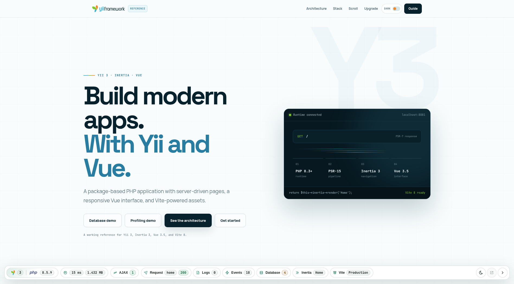
    </picture>
</p>

> [!WARNING]
> **Development only.** Never enable the debugger in production. Keep access restricted to trusted development IPs
> and install production dependencies with `composer install --no-dev`.

## Features

<picture>
    <source media="(min-width: 768px)" srcset="docs/svgs/features.svg">
    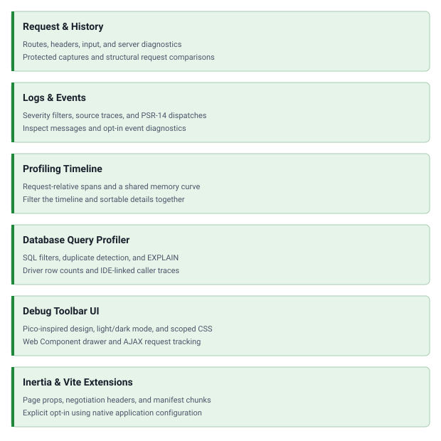
</picture>

## Quick start

### Installation

Requires PHP 8.3 or newer and a Yii3 application using Yii Config Plugin.

```shell
composer require yii3/debug --dev
```

### Enable the debugger

Set the vendor override layer in your application's `composer.json`, keeping any existing `extra` settings:

```json
{
    "extra": {
        "config-plugin-options": {
            "vendor-override-layer": "yii3/debug"
        }
    }
}
```

Rebuild the application configuration after changing this setting:

```shell
composer yii-config-rebuild
```

Run the application with `APP_ENV=dev`. The debugger also accepts `debug` and `test`; it stays disabled when the
runtime environment is missing, unknown, or production. Setting the runner's configuration environment alone is
not enough.

The package registers its routes, toolbar middleware, logging, and event capture automatically. Your application
must use the merged `yiisoft/middleware-dispatcher.middlewares` parameters for its middleware pipeline. If it defines
its own logger, preserve the targets in `yiisoft/log.targets`; custom PSR loggers and event dispatchers need a
separate integration.

### Basic usage

Open an application page, expand the toolbar at the bottom, and select a panel chip to inspect the request.
Use the Yii chip for Configuration and the PHP chip for PHP info. Switch between light and dark themes from the
toolbar, and press `Escape` to close the drawer.

Open `/debug` to browse retained requests. Select two captures in History to compare request metrics and panel
changes, then open either capture for its details. Comparison shows structural counts without exposing panel values.

## Configuration

Override only the options you need in your application's parameters:

```php
return [
    'yii3/debug' => [
        'allowedIPs' => ['127.0.0.1', '::1'],
        'historySize' => 50,
        'routePrefix' => '/debug',
        'storage' => [
            'path' => '@runtime/debug',
        ],
        'toolbar' => [
            'position' => 'bottom',
        ],
    ],
];
```

These are the defaults: local access only, up to 50 retained requests, and captures stored under `@runtime/debug`.
Changing `routePrefix` also changes the History URL. The storage path accepts a registered Yii alias.

### Inertia and Vite

Enable either integration when your application uses the corresponding package:

```php
return [
    'yii3/debug' => [
        'extensions' => [
            'inertia' => true,
            'vite' => true,
        ],
    ],
];
```

Both are disabled by default. Inertia requires a compatible `yii3/inertia ^0.1` revision providing
`Yii3\Inertia\ResolvedPageObserver`. Vite uses the application's existing `php-forge/vite` configuration and entrypoints.
Keep the debugger, Debug Core, and enabled integration packages up to date together in the application's lock file.

An extension appears in the sidebar only when the selected request contains its data. Vite's **Production** label
means it is inspecting built assets in your development application, not that the debugger can run in production.

### Database

Database capture requires a Yii DB 2 driver and an instrumented application connection. For example, if your SQLite
application already registers its configured connection as `Yiisoft\Db\Sqlite\Connection`, add this factory to your
development-only DI configuration. The container supplies that connection and the debugger's registered profiler:

```php
use Yii3\Debug\Db\DebugDbProfiler;
use Yiisoft\Db\Connection\ConnectionInterface;
use Yiisoft\Db\Sqlite\Connection;

return [
    ConnectionInterface::class => static function (
        Connection $connection,
        DebugDbProfiler $debugDbProfiler,
    ): ConnectionInterface {
        $debugDbProfiler->instrument($connection);

        return $connection;
    },
];
```

Keep the existing concrete `Connection` registration and its driver settings; it must not resolve back to
`ConnectionInterface`. For another PDO driver, use its configured concrete connection class instead of SQLite's.
EXPLAIN supports MySQL, SQLite, and PostgreSQL and
requires the application's `Yiisoft\Db\Connection\ConnectionInterface` binding to match the captured queries.
Leave EXPLAIN unconfigured when one binding cannot represent all captured connections.

### IDE links

Source traces use `ide://` links by default. Set `traceLine` to `false` for plain file names and line numbers, or
provide your editor's URL template in the `yii3/debug` parameters:

```php
'traceLine' => '<a href="phpstorm://open?file={file}&line={line}">{text}</a>',
```

For containers or remote environments, map captured paths to your local project:

```php
'tracePathMappings' => ['/var/www/html' => '/home/developer/projects/app'],
```

## Security

The toolbar and debugger routes allow `127.0.0.1` and `::1` by default. Access checks use the direct client address,
not forwarded proxy headers. Add only trusted development addresses to `allowedIPs`; never expose the debugger publicly.

Request and Inertia captures redact sensitive fields and URL query values. Logs preserve original diagnostic values
and are not redacted by the capture policy; SQL diagnostics can include substituted query values. Treat stored captures
as sensitive and review them before sharing. In the Events panel, context capture and source traces are disabled by
default; this does not affect source traces in Logs or Database.

## Screenshots

Expand a panel to preview it. Images follow your GitHub light or dark theme.

<details>
<summary>History</summary>
<picture>
    <source media="(prefers-color-scheme: dark)" srcset="docs/images/history-dark.png">
    <source media="(prefers-color-scheme: light)" srcset="docs/images/history-light.png">
    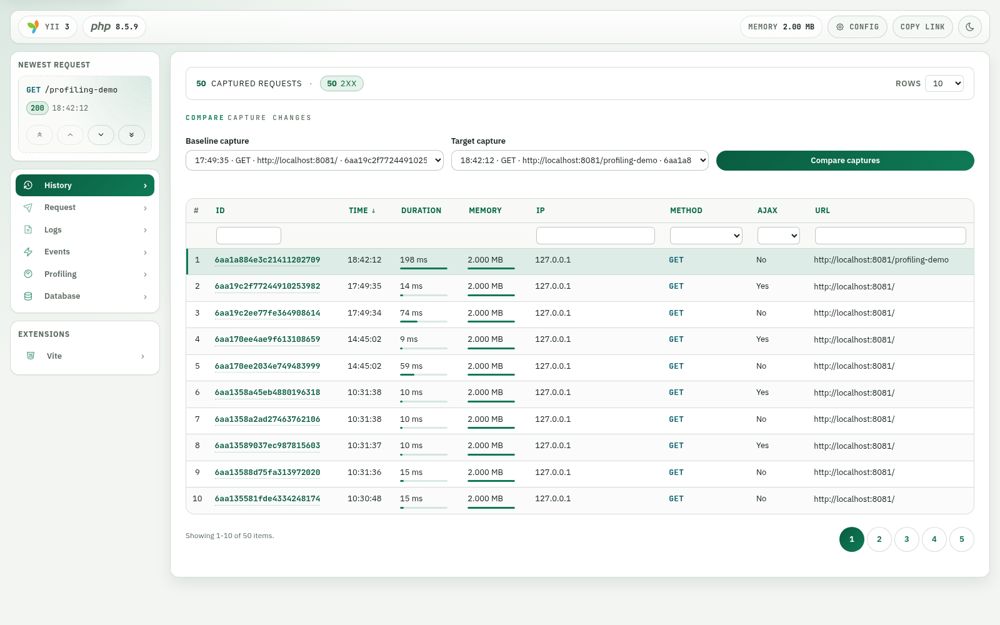
</picture>
</details>

<details>
<summary>Request</summary>
<picture>
    <source media="(prefers-color-scheme: dark)" srcset="docs/images/request-dark.png">
    <source media="(prefers-color-scheme: light)" srcset="docs/images/request-light.png">
    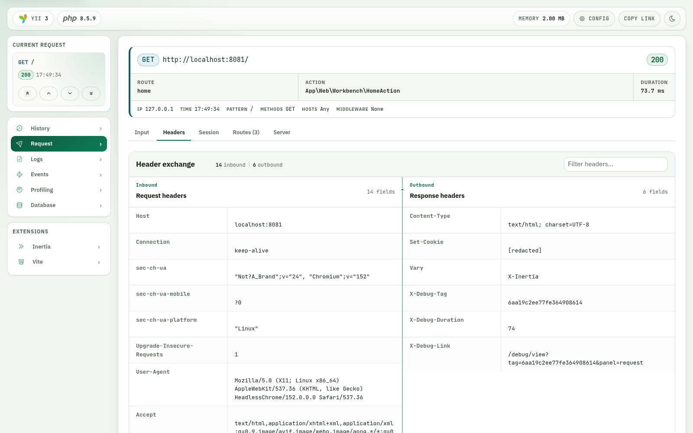
</picture>
</details>

<details>
<summary>Logs</summary>
<p>This capture contains no log messages; the panel displays its empty state.</p>
<picture>
    <source media="(prefers-color-scheme: dark)" srcset="docs/images/log-dark.png">
    <source media="(prefers-color-scheme: light)" srcset="docs/images/log-light.png">
    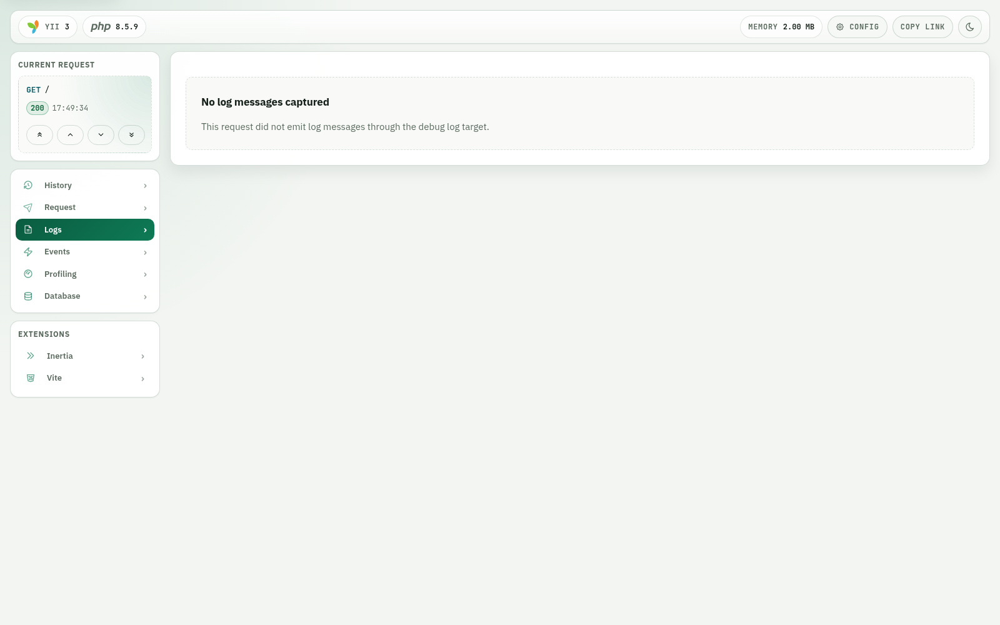
</picture>
</details>

<details>
<summary>Events</summary>
<picture>
    <source media="(prefers-color-scheme: dark)" srcset="docs/images/event-dark.png">
    <source media="(prefers-color-scheme: light)" srcset="docs/images/event-light.png">
    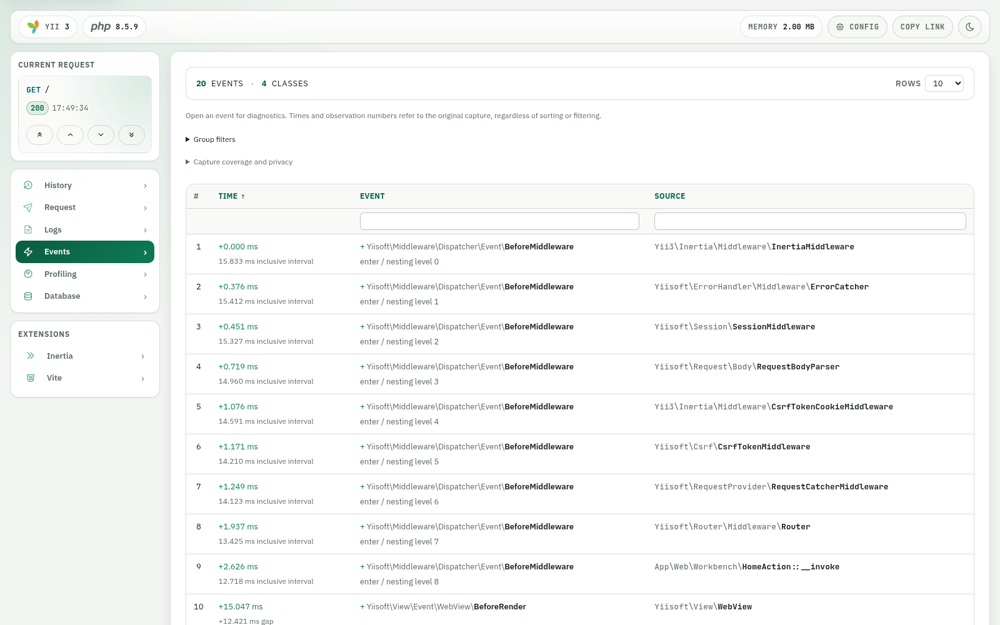
</picture>
</details>

<details>
<summary>Profiling</summary>
<picture>
    <source media="(prefers-color-scheme: dark)" srcset="docs/images/profiling-dark.png">
    <source media="(prefers-color-scheme: light)" srcset="docs/images/profiling-light.png">
    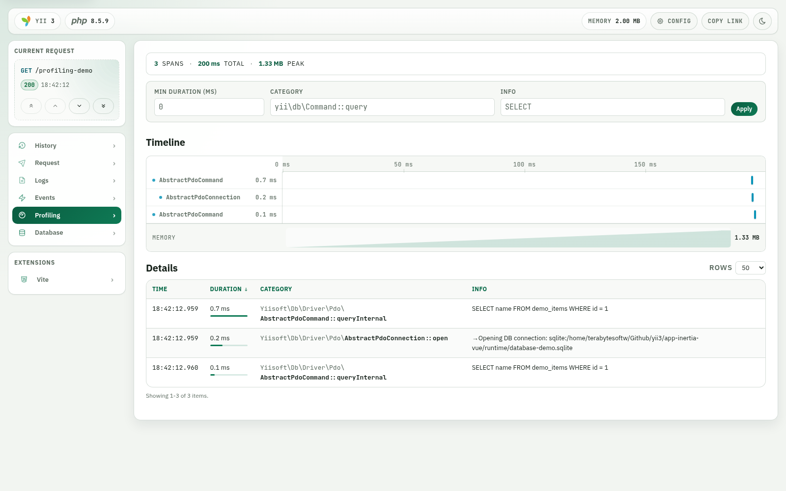
</picture>
</details>

<details>
<summary>Database</summary>
<picture>
    <source media="(prefers-color-scheme: dark)" srcset="docs/images/database-dark.png">
    <source media="(prefers-color-scheme: light)" srcset="docs/images/database-light.png">
    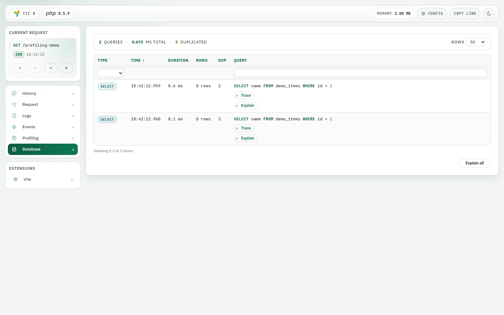
</picture>
</details>

<details>
<summary>Configuration</summary>
<picture>
    <source media="(prefers-color-scheme: dark)" srcset="docs/images/config-dark.png">
    <source media="(prefers-color-scheme: light)" srcset="docs/images/config-light.png">
    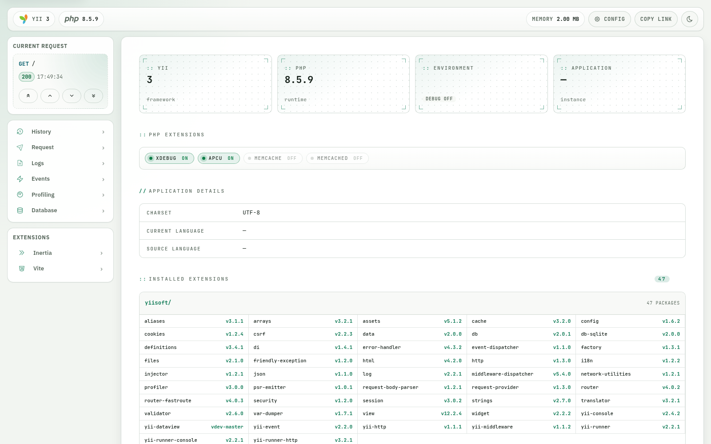
</picture>
</details>

<details>
<summary>PHP info</summary>
<picture>
    <source media="(prefers-color-scheme: dark)" srcset="docs/images/phpinfo-dark.png">
    <source media="(prefers-color-scheme: light)" srcset="docs/images/phpinfo-light.png">
    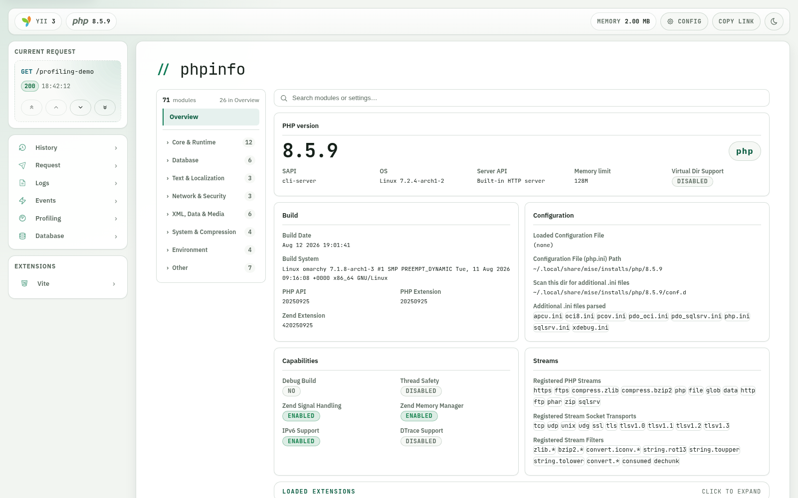
</picture>
</details>

<details>
<summary>Inertia</summary>
<picture>
    <source media="(prefers-color-scheme: dark)" srcset="docs/images/inertia-dark.png">
    <source media="(prefers-color-scheme: light)" srcset="docs/images/inertia-light.png">
    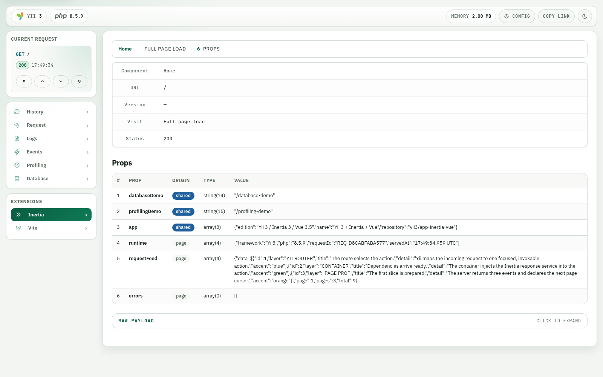
</picture>
</details>

<details>
<summary>Vite</summary>
<picture>
    <source media="(prefers-color-scheme: dark)" srcset="docs/images/vite-dark.png">
    <source media="(prefers-color-scheme: light)" srcset="docs/images/vite-light.png">
    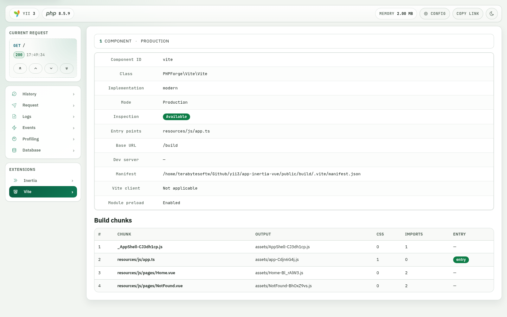
</picture>
</details>

## Documentation

- [Default configuration options](config/params.php)

## Package information

[](https://www.php.net/releases/8.3/en.php)
[](https://github.com/yiisoft)
[](https://packagist.org/packages/yii3/debug)

## Project status

[](https://codecov.io/github/yii3/debug)
[](https://github.com/yii3/debug/actions/workflows/static.yml)
[](https://github.com/yii3/debug/actions/workflows/quality.yml)
[](https://github.com/yii3/debug/actions/workflows/ecs.yml)

## Our social networks

[](https://x.com/Terabytesoftw)
[](https://www.facebook.com/wilmer.arambula.9)
[](https://www.reddit.com/r/Yii2/)
[](https://t.me/yii_framework_in_english)

## License

[](LICENSE)
